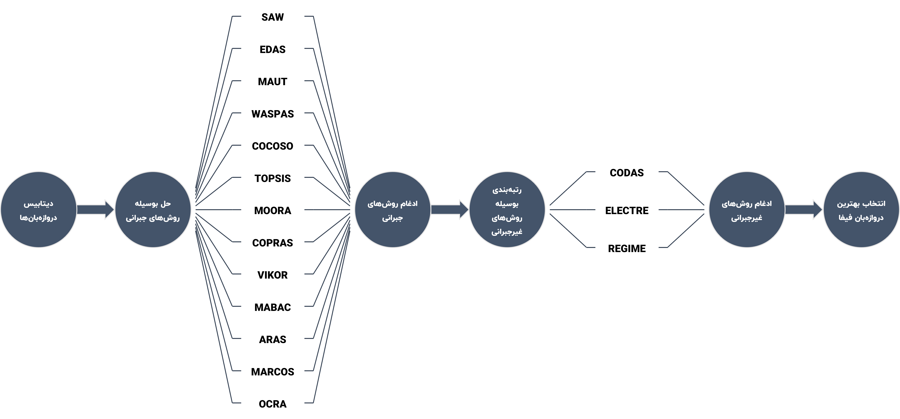

# MCDM Methods

| Sign | Meaning  |
|------|----------|
| 🟢   | Pass     |
| 🟡   | Pending  |
| 🔴   | Fail     |
| ✅    | Included |

## Assessment

|  #  | Method  | Format | Status | Doc |
|:---:|:--------|:------:|:------:|:---:|
|  1  | BWM     |  .py   |   🟢   |  ✅  |
|  2  | SAW     | .xlsx  |   🟢   |  ✅  |
|  3  | EDAS    | .xlsx  |   🟢   |  ✅  |
|  4  | MAUT    | .xlsx  |   🟢   |  ✅  |
|  5  | WASPAS  | .xlsx  |   🟢   |  ✅  |
|  6  | COCOSO  | .xlsx  |   🟢   |  ✅  |
|  7  | TOPSIS  | .xlsx  |   🟢   |  ✅  |
|  8  | MOORA   | .xlsx  |   🟢   |  ✅  |
|  9  | COPRAS  | .xlsx  |   🟢   |  ✅  |
| 10  | VIKOR   | .xlsx  |   🟢   |  ✅  |
| 11  | MABAC   | .xlsx  |   🟢   |  ✅  |
| 12  | ARAS    | .xlsx  |   🟢   |  ✅  |
| 13  | MARCOS  |  .py   |   🟢   |  ✅  |
| 14  | OCRA    |  .py   |   🟢   |  ✅  |
| 15  | CODAS   |  .py   |   🟢   |  ✅  |
| 16  | ELECTRE |  .py   |   🟢   |  ✅  |
| 17  | REGIME  |  .py   |   🟢   |  ✅  |

## Attributes

## Process

