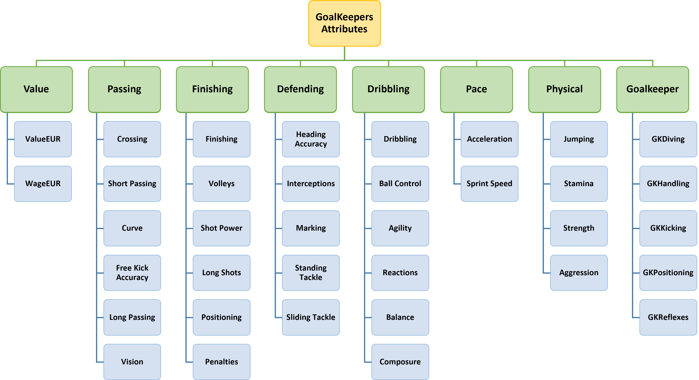

# MCDM Methods

## Criteria Assessment

|  #  | Method | Format | Status |
|:---:|:-------|:------:|:------:|
|  1  | BWM    |  .py   |   🟢   |
|  2  | AHP    |   -    |   🟡   |

## Alternative Assessment

|  #  | Method    | Format | Status |
|:---:|:----------|:------:|:------:|
|  1  | SAW       | .xlsx  |   🟢   |
|  2  | EDAS      | .xlsx  |   🟢   |
|  3  | MAUT      | .xlsx  |   🟢   |
|  4  | WASPAS    | .xlsx  |   🟢   |
|  5  | COCOSO    | .xlsx  |   🟢   |
|  6  | TOPSIS    | .xlsx  |   🟢   |
|  7  | MOORA     | .xlsx  |   🟢   |
|  8  | COPRAS    | .xlsx  |   🟢   |
|  9  | VIKOR     | .xlsx  |   🟢   |
| 10  | MABAC     | .xlsx  |   🟢   |
| 11  | ARAS      | .xlsx  |   🟢   |
| 12  | MAIRCA    | .xlsx  |   🟢   |
| 13  | MARCOS    |  .py   |   🟢   |
| 14  | OCRA      |  .py   |   🟢   |
| 15  | CODAS     |  .py   |   🟢   |
| 16  | ELECTRE   |  .py   |   🟢   |
| 17  | REGIME I  |  .py   |   🟢   |
| 18  | REGIME II |  .py   |   🟢   |

## Attributes

